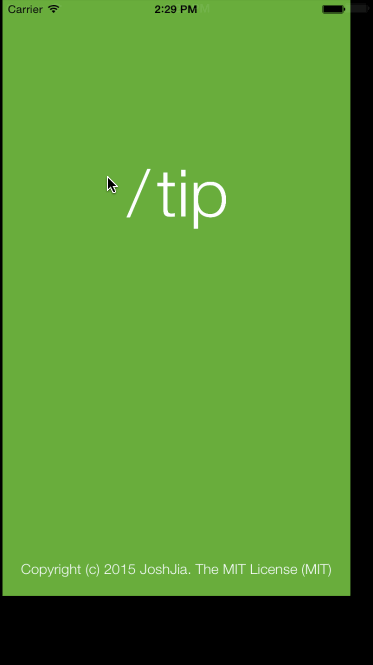
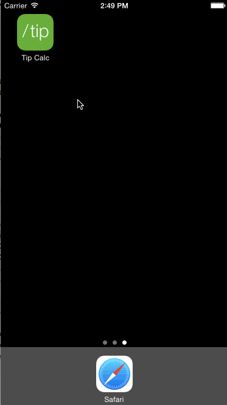

# tipCalculator
A simple yet awesome Tip Calculator

This iOS app is for the [Codepath](http://courses.codepath.com/snippets/intro_to_ios/thanks_for_applying) [pre-assignment](https://gist.github.com/timothy1ee/7747214) 

Time spent: Pulled an all nighter

Completed
---

* [x] Required: User can enter a bill amount, choose a tip percentage, and see the tip and total values.
* [x] Required: Settings page to change the default tip percentage.

---

* [x] Optional: UI animations
* [x] Optional: Remembering the bill amount across app restarts (Adjuestble time frame!)
* [x] Optional: Using locale-specific currency and currency thousands separators.
* [x] Optional: Making sure the keyboard is always visible and the bill amount is always the first responder.

---

* [x] Just4Fun: Awesome Logo included
* [x] Just4Fun: Split bill in any way (Adjuestble in setting)
* [x] Just4Fun: View will auto adjuest according to keyboard height (Turn off "Use Number Keyboard Only")
* [x] Just4Fun: A great setting page, give it a go
* [x] Just4Fun: Error checking (How exciting)

---

* [x] Built using MVC
* [x] The "User", "CurrentUser" and "Bill" object/model supports multi-user, only need to implement "VC" in "MVC" 
* [x] Many more fun stuff :)

Video Walkthrough
---

GIF created with [LiceCap](http://www.cockos.com/licecap/).
