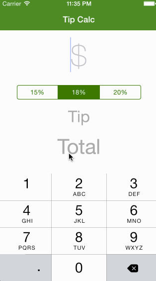

# tipCalculator
A Simple Tip Calculator

This iOS app is for the Codepath [pre-assignment](https://gist.github.com/timothy1ee/7747214)

Time spent: 6 hours

Completed:

* [x] Let user enter a amount and choose tip percentage, the app will show the tips and total bill
* [x] Let the keyboard be the first responder, so user can enter an amount at any time.
* [x] The app will remember the tip setting even after the app restarts.
* [x] Use MVC to build the APP for better expandability.

GIF created with [LiceCap](http://www.cockos.com/licecap/).
